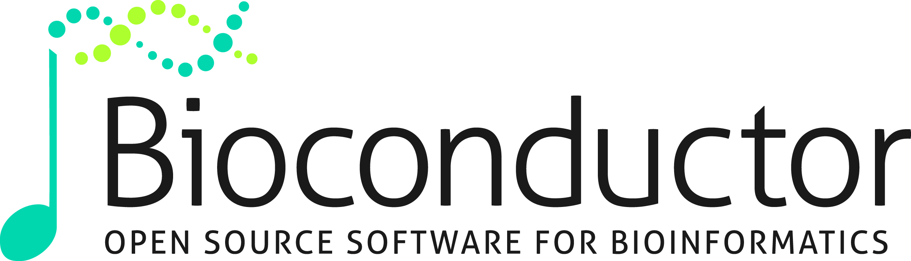

 

# European Bioconductor Meeting 2019

The 2019 edition of the **European Bioconductor Meeting** will be
hosted at the UCLouvain in Belgium:

- Where: [de Duve Institute, UCLouvain, Campus de Woluwé, Brussels, Belgium](https://goo.gl/maps/dUy5A1evKHmTuHKm8)
- When: 9 - 10 December 2019
- On twitter: [#EuroBioc2019](https://twitter.com/search?q=%23EuroBioc2019)

## Introduction

The meeting is aimed at biologists, bioinformaticians, statisticians,
programmers and software engineers who use or contribute to the
[Bioconductor project](https://www.bioconductor.org/), or are
interested in using Bioconductor. The goals are to:

- foster the exchange of technical expertise
- keep contributors up to speed with the latest developments
  coordinate any related efforts.

The main conference will be on Monday 9 and Tuesday 10 December 2019. 

## Key dates (tentative)
-  1 Oct: Abstract deadline
- 31 Oct: Notice of acceptance
- 15 Nov: Registration deadline
- 9-10 Dec: European Bioconductor Meeting

## Registrations

Will open soon.

## Code of conduct

Bioconductor is built on the free and open exchange of scientific
ideas, and the contributions of our diverse user community. In this
spirit, EuroBioc 2018 is dedicated to providing a harassment-free
conference experience for everyone. Harassment of any form (verbal,
physical, sexual, or other) will not be tolerated in talks, workshops,
social activities, or online.

Reach out to conference organizers (laurent.gatto@uclouvain.be) or our
on-site response team with any concern (Laurent Gatto).

## Previous meetings

If you have not previously attended any European Bioconductor
meetings, you can get an idea about the topics and talks by looking at
the programmes from the
[2018](https://bioconductor.github.io/EuroBioc2019/),
[2017](https://bioconductor.github.io/EuroBioc2017/), and
[2015](https://sites.google.com/site/eurobioc2015/) editions.

## Organising committee

- [Laurent Gatto](https://lgatto.github.io/about/), UCLouvain,
  Belgium.
- [Wolfgang Huber](https://www.embl.de/research/units/genome_biology/huber/),
  European Microbiology Laboratory (EMBL), Heidelberg.
- [Martin Morgan](https://www.roswellpark.org/martin-morgan), Roswell
  Park Comprehensive Cancer Center, Buffalo.

## Sponsor opportunities

Interested in sponsoring this conference? Please contact
contact-cbio@uclouvain.be.

More details will follow soon.

<!-- * Gold: Up to 4 free registrations. Present a talk about R&D in your -->
<!--   company (relevant to the bioconductor community but not necessarily -->
<!--   based on bioconductor). 1 poster in the foyer. Recognition in -->
<!--   promotional and scheduling material. Sponsored food or social event -->
<!--   (e.g. Coffee break, Dinner, etc.). 2,500 Eur -->

<!-- * Silver: Up to 2 free registrations. Recognition in promotional and -->
<!--   scheduling material. 1,000 Eur -->

## Contact

More information? Contact us at contact-cbio@uclouvain.be.

