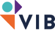



## Introduction

The European _Bioconductor_ meeting is aimed at biologists,
bioinformaticians, statisticians, programmers and software engineers
who use or contribute to the [Bioconductor
project](https://www.bioconductor.org/), or are interested in using
Bioconductor. The goals are to:

- foster the exchange of technical expertise
- keep contributors up to speed with the latest developments
- coordinate any related efforts

The main conference will be on Monday 9 and Tuesday 10
December 2019. An optional developer/user day is scheduled on the 11
December.

## Programme

The conference will include 10 invited talks (30 minutes) and
flashlight presentations (8 minutes - see below for details). See the
[Registration](./registration) for details about the abstract
submission and the [conference schedule](./conference_schedule) for
details.

## Invited speakers

- [Levi Waldron](https://waldronlab.io/), Bioconductor, CUNY Graduate
  School of Public Health and Health Policy, New York, USA.
- [Vince
  Carey](https://connects.catalyst.harvard.edu/Profiles/display/Person/42421),
  Bioconductor, Channing Laboratory, Brigham And Women's Hospital,
  Harvard Medical School, USA.
- [Martin Morgan](https://www.roswellpark.org/martin-morgan),
  Bioconductor, Roswell Park Comprehensive Cancer Center, Buffalo, USA.
- [Andreas
  Moor](https://www.imcr.uzh.ch/en/research/Moor/Team/Moor.html),
  Institute of Molecular Cancer Research, University of Zurich, Switzerland.
- [Elisabetta Mereu](https://elisabettamereu.netlify.com/), Single
  Cell Genomics Team, CNAG Center for Genomic Regulation, Barcelona, Spain.
- [Ewa Szczurek](https://www.mimuw.edu.pl/~szczurek/), Institute of
  Informatics, University of Warsaw, Poland.
- [Davide Risso](https://drisso.github.io/), Department of Statistical
  Sciences, University of Padova, Italy.
- [Lieven Clement](https://statomics.github.io/pages/about),
  Statistical Omics Group, Ghent University, Belgium.
- [Christine Choirat](https://scholar.harvard.edu/cchoirat/home),
  Swiss Data Science Center, Switzerland.
- [Andrea Rau](https://www.andrea-rau.com/), INRA, GABI/PSGen, France.

## Group discussion

The group discussions will be based on a invited talk, and will give
the participants the opportunity to continue the discussion under the
moderation of the speaker and other experts present at the
conference. We have around 4 topics (see below); participants will
choose which group discussion to contribute to at the beginning of the
second day.

The group discussion topics are:

- The Bioconductor project: getting started and moving from user to
  developer/contributor. Group moderator: Martin Morgan (Bioconductor,
  Roswell Park Comprehensive Cancer Center).

- Single cell assays (including RNA-seq). Group moderator: Davide
  Risso (University of Padova) and Dries De Maeyer (Janssen
  Pharmaceutica NV).

- Containers and cloud computing for bioinformatics. Group moderators:
  Christine Choirat (Swiss Data Science Center) and Vince Carey
  (Bioconductor, Harvard Medical School).

- Multi-omics data integration. Group moderator: Levi Waldron (City
  University of New York).

## Flashlight sessions

Flashlights are intended to be short presentations covering a single
topic e.g. a new package or a particular technical problem you have
encountered. Each talk has been allotted **8 minutes** and presenters
should aim for approximately 6 slides. The following rules will apply
in these sessions in order to keep things flowing:

- There will be a warning at 7 minutes.
- At this point the next talk will be set up on the computer, allowing
  the next speaker to get going immediately when their time begins.
- Flashlight talks will be interrupted (possibly mid-syllable) at the
  8 minute mark regardless of how many slides the speaker has left.

Speakers, please share you slides with your session chair in the
tea/lunch break preceding your session. Presentations will be
transferred to a single computer to ensure the smooth running of the
session. It's safest to use a PDF.

## User/developer sessions (free, optional)

We invite participants to form groups dedicated to discuss or work on
topics of interest on Wednesday. We have booked rooms for the
respective groups. The topics are set by one group leader, and are
advertised in advance of the event on the conference page.

To create a user/developer session, [open an
issue](https://github.com/Bioconductor/EuroBioc2019/issues) describing
the topic. The issue title should start with `GROUP:` followed by a
short but descriptive title. Describe the topic in the main body of
the issue in as much detail as necessary, including the name of the
topic leader, a chair and a scribe (to report, see below), possible or
desired outputs (could be code, a piece of documentation, or general
discussion), and possible outcomes. Any interested participants are
invited to use the issue to ask questions and/or express their
interest in participating.

On Wednesday after, we ask that each group prepares a short summary of
their session, which will be coordinated by a chair (who may or may
not be the person that suggested the topic) and a scribe.

## Sponsors

We would like to acknowledge the financial support of our sponsors for
making this event possible.

### Gold sponsor

### Bronze sponsor

### Other

