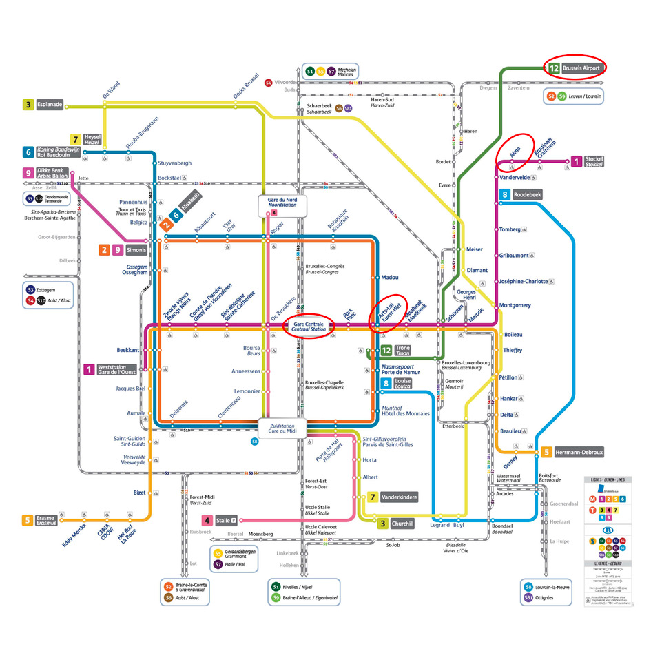
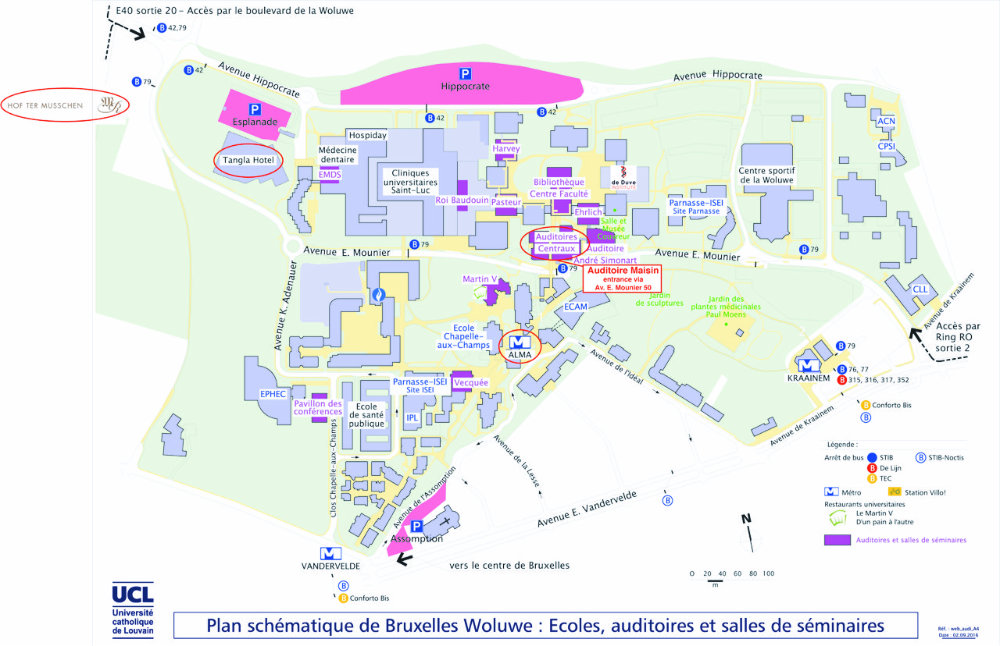



## Getting there

The lectures will be help in the *Auditoire Maisin* in the *Auditoires
centraux* of the Woluwé campus of the UCLouvain.

<iframe src="https://www.google.com/maps/embed?pb=!1m18!1m12!1m3!1d1259.4633910391408!2d4.453708800569387!3d50.85104009819093!2m3!1f0!2f0!3f0!3m2!1i1024!2i768!4f13.1!3m3!1m2!1s0x47c3dd035b543e07%3A0x6523b8892e3ea75a!2sAuditoire%20MAISIN!5e0!3m2!1sen!2sbe!4v1575580459238!5m2!1sen!2sbe" width="600" height="450" frameborder="0" style="border:0;" allowfullscreen=""></iframe>

The university campus is easily accessible from the major train
stations of international Zaventem airport by tube (see map below),
metro line 1, direction *Stockel/Stokkel*, station *Alma*.

The *Auditoire Maisin* is then a 3 - 4 minutes walk from the metro
station. The map below also show the Tangla hotel and the Hof Ter
Musschen restaurant that will host us for the social dinner on Monday
evening.

